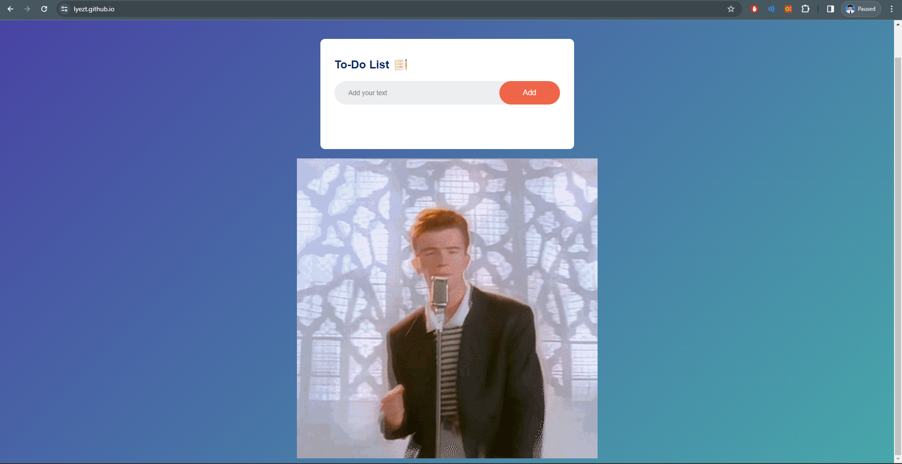

# Todolist Web App
#### Video Demo:  https://youtu.be/97eIYbKjNzs
#### Website: https://lyezt.github.io/
# Description:

## Overview
This web application is a simple Todo List that allows users to add and manage their tasks. It provides a clean and intuitive interface for organizing your to-do items.

## Features
- Add tasks: Enter your task in the input box and click "Add" or press "Enter" to add it to the list.
- Task List: View your tasks in a clear and organized list format.
- Rick Roll Surprise: Enjoy a surprise Rick Roll hidden in the footer!

## Usage
1. Open https://lyezt.github.io/ in your web browser.
2. Enter a task in the input box and click the "Add" button to add it to the list.
3. View and manage your tasks in the list.

## Project Structure
- `index.html`: Main HTML file containing the structure of the web page.
- `static/style.css`: CSS file for styling the web page.
- `static/images/`: Directory containing images used in the project.
- `script.js`: JavaScript file for handling the dynamic functionality of the Todo List.

## JavaScript Challenges and Development
- **Creating a Database:**
  The JavaScript component posed a considerable challenge, especially when attempting to create a database to store user actions. Despite initial struggles, I sought assistance from YouTube tutorials to successfully complete this task.

- **Dynamic Task Management:**
  The JavaScript code handles dynamic task management, allowing users to add, mark as completed, and delete tasks seamlessly.

- **Event Listeners:**
  Event listeners are used to capture user interactions, such as adding tasks on button click or pressing "Enter" in the input box.

## Learning Experiences
- **CSS Styling:**
  For the CSS part, I turned to YouTube tutorials to learn various techniques for decorating and styling the website. These resources greatly contributed to my understanding of web design.

- **Development Environment:**
  Besides this, I acquired skills in opening a live server and using Visual Studio Code, marking a departure from my previous reliance on the CS50 workspace.

## Future Plans
- I initially aspired to create a Texas poker bot for the final project. However, due to time constraints and the need for a university application certificate, I opted for a simpler approach. Future plans include revisiting the poker bot idea once I master the AI and ML course.

## Fun Facts
- My friend suggested the Rick Roll surprise, and I appreciate them for this clever idea.

# Overall opinion
#### This is my first personal website! It was more manageable than I initially anticipated, especially after taking CS50. While I initially wanted to develop it using React, mastering it within my time constraints was challenging. I also try to use flask to do a login and sign up page before and I already done the webpage but the button wasn't functioning so I give up doing this, I will try to do it next time after I have time. The biggest reason  that I give up adding so many feature that is because I needed the certificate for my university application as it is soon close. Consequently, I opted for a simpler approach using CSS, HTML, and JavaScript.

#### The structure of the index.html is straightforward, featuring div elements to cleanly separate blocks and enhance the website's overall appearance.
#### The JavaScript component, to be honest, posed a considerable challenge. I found it to be quite hard, especially when attempting to create a database to store user actions. Despite my efforts, I struggled with this aspect and ultimately sought assistance from YouTube tutorials to successfully complete the task.
#### For the CSS part, I turned to YouTube tutorials to learn various techniques for decorating and styling the website. These resources greatly contributed to my understanding of web design.
#### Besides of this,  I acquired skills in opening a live server and using Visual Studio Code, marking a departure from my previous reliance on the CS50 workspace.
#### Fun fact: My original concept for the final project differed. I initially aspired to create a Texas poker bot capable of calculating the user's win rate and providing guidance on decisions such as flopping, raising, or checking. However, I soon realized that achieving this required knowledge in machine learning, a realm more intricate than I had anticipated. Nevertheless, I am determined to accomplish this project once I master the AI and ML course. Another fun fact is, the rickroll is my friend idea hahahaha, I really appreaciate them for giving me this good advise.
